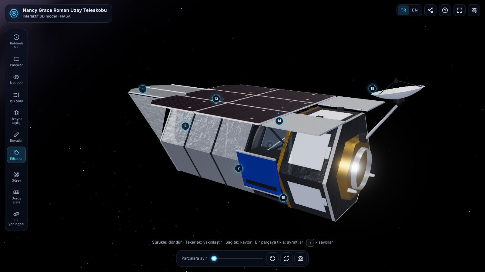
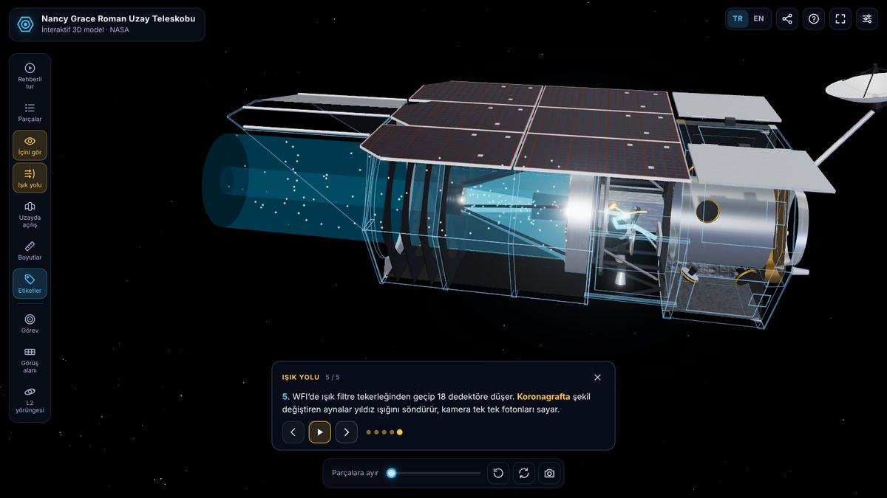
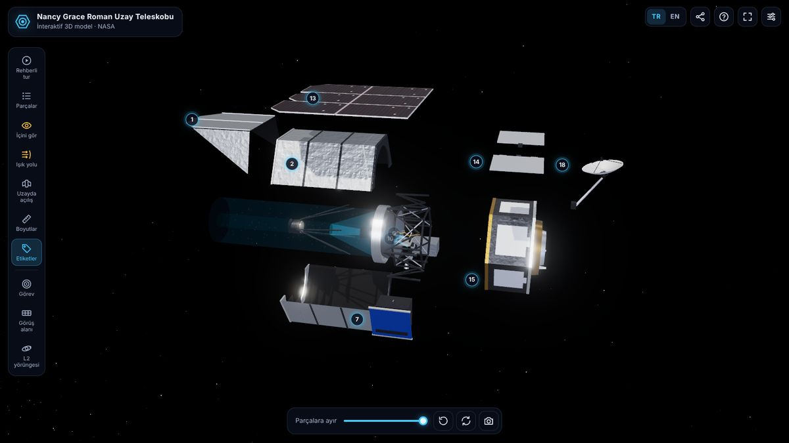
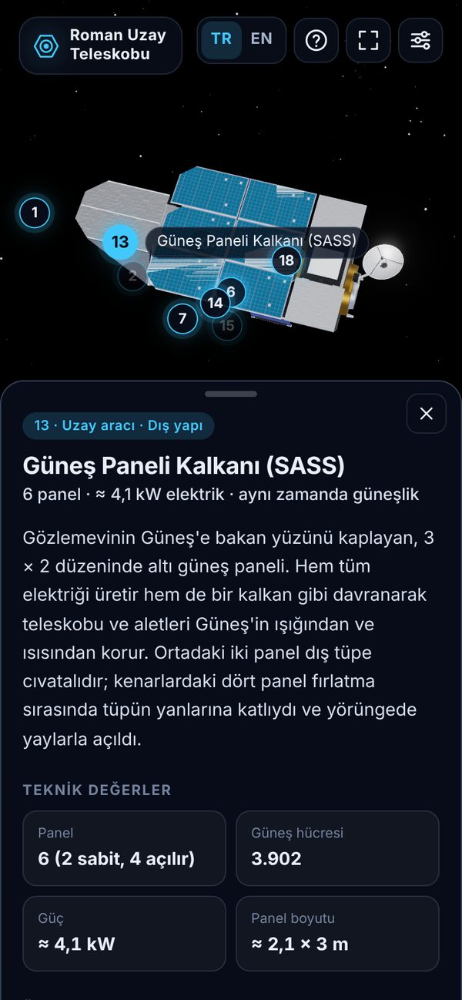

# Roman Uzay Teleskobu 3D

[](https://pandakingpunc.github.io/RomanTeleskop3D/)
[](https://github.com/pandakingpunc/RomanTeleskop3D/actions/workflows/ci.yml)
[](LICENSE)

NASA'nın **Nancy Grace Roman Uzay Teleskobu**'nu tarayıcıda keşfetmek için interaktif bir 3D model.
Parçalarına ayırın, içini kesit olarak görün, yıldız ışığının aynalardan dedektörlere uzanan yolunu
ve gözlemevinin uzayda açılışını adım adım izleyin. Türkçe ve İngilizce.

**Canlı demo:** https://pandakingpunc.github.io/RomanTeleskop3D/



> Roman, 30 Ağustos 2026'da Falcon Heavy ile fırlatıldı ve şu anda Güneş–Dünya L2 noktasına
> yolculuk ediyor. Modeldeki bilgiler 9 Ekim 2026 itibarıyla NASA kaynaklarına göre güncellenmiştir.

## Neler var?

- **Gerçeğe yakın 3D model** — NASA çizimleri ve mühendislik makalelerine göre yeniden kuruldu:
  altıgen dış tüp, açılır siperlik, 6 panelli güneş kalkanı, alet taşıyıcı, Geniş Alan Aleti,
  koronagraf, altıgen gövde ve açılır anten (açılmış uzunluk ≈ 12,7 m, gerçek ölçekte).
- **18 parça, iki dilde ayrıntılı bilgi** — her parça için açıklama, teknik değerler ve öne çıkanlar.
- **İçini gör (kesit görünümü)** — dış kabuklar kameraya bakan yarıdan kesilir; birincil ayna,
  ikincil ayna, dedektörler, filtre tekerleği, yakıt tankları ve tepki tekerlekleri görünür.
- **Işık yolu** — fotonların 5 adımda birincil aynadan ikincil aynaya, oradan iki alete
  (WFI mavi, koronagraf sarı) yolculuğu.
- **Uzayda açılış** — fırlatma (katlı) hâlinden güneş panellerinin, antenin ve siperliğin gerçek
  tarihleriyle açılışına kadar animasyon.
- **Rehberli tur** — 10 duraklı, anlatımlı kamera turu.
- **Parçalara ayırma** — dış tüp ikiye ayrılır, aletler ve gövde dışarı açılır.
- **Boyutlar ve ölçek** — uzunluk, genişlik, ayna çapı ve karşılaştırma için 1,8 m'lik insan figürü.
- **Görev paneli** — bilim hedefleri, dört büyük tarama, sayılarla Roman ve gerçek tarihlere bağlı
  zaman çizelgesi.
- **Görüş alanı karşılaştırması** — Roman'ın 18 dedektörlük alanı, Hubble WFC3/IR ve dolunay
  (ölçekli SVG).
- **L2 yörüngesi** şeması ve açıklaması.
- **Paylaşılabilir bağlantılar**, ekran görüntüsü alma, tam ekran, otomatik döndürme.
- **Mobil uyumlu** — telefonda alt araç çubuğu ve alttan açılan bilgi sayfaları.
- **Erişilebilirlik** — klavye kısayolları, ekran okuyucu etiketleri, odak göstergeleri,
  "hareketi azalt" tercihine uyum, yüksek kontrast desteği.
- **Performans** — yalnızca gerektiğinde çizim (pil dostu), cihaza göre otomatik kalite,
  yavaş cihazlarda kendiliğinden kalite düşürme.
- **Çevrimdışı çalışma (PWA)** — bir kez açıldıktan sonra internet olmadan da açılır; ana ekrana
  uygulama olarak eklenebilir.

| Işık yolu | Parçalara ayrılmış | Telefon |
| --- | --- | --- |
|  |  |  |

## Kullanım

| Fare / dokunmatik | |
| --- | --- |
| Sürükle / tek parmak | Döndür |
| Tekerlek / iki parmak | Yakınlaştır |
| Sağ tuşla sürükle / iki parmakla kaydır | Kaydır |
| Parçaya tıkla / dokun | Ayrıntıları aç |
| Boş alana çift tıkla | Görünümü sıfırla |

| Klavye | |
| --- | --- |
| <kbd>T</kbd> | Rehberli tur |
| <kbd>P</kbd> | Parça listesi |
| <kbd>I</kbd> | İçini gör |
| <kbd>L</kbd> | Işık yolu |
| <kbd>D</kbd> | Uzayda açılış |
| <kbd>E</kbd> | Parçalara ayır / birleştir |
| <kbd>M</kbd> | Boyutlar |
| <kbd>H</kbd> | Etiketleri göster / gizle |
| <kbd>←</kbd> <kbd>→</kbd> | Önceki / sonraki parça |
| <kbd>R</kbd> | Görünümü sıfırla |
| <kbd>O</kbd> | Otomatik döndür |
| <kbd>F</kbd> | Tam ekran |
| <kbd>Esc</kbd> | Paneli ya da modu kapat |
| <kbd>?</kbd> | Yardım |

### Paylaşılabilir bağlantılar

Adres çubuğu o an açık olan görünümü yansıtır; bağlantıyı paylaşan kişi aynı yere gelir:

| Bağlantı | Açılan |
| --- | --- |
| `#part=wfi` | Bir parça (ör. `primary`, `secondary`, `wfi_detector`, `cgi`, `sass`, `antenna`…) |
| `#tour` · `#light` · `#deploy` | Rehberli tur · ışık yolu · uzayda açılış |
| `#mission` · `#fov` · `#l2` · `#about` | Görev · görüş alanı · L2 · hakkında panelleri |
| `?lang=en` | Dili seçer (`tr` ya da `en`) |

Örnek: https://pandakingpunc.github.io/RomanTeleskop3D/?lang=en#part=wfi_detector

## Yerelde çalıştırma

Tarayıcılar JavaScript modüllerini `file://` adresinden yüklemediği için `index.html` dosyasını
çift tıklayarak açmak yerine küçük bir yerel sunucu kullanın:

```bash
npm start                 # Node.js 20+ (bağımlılık gerekmez) → http://localhost:8080
# ya da
python3 -m http.server 8080
```

Derleme adımı yoktur; dosyayı kaydedip sayfayı yenilemeniz yeterli. 3D kütüphanesi (three.js 0.186.1)
jsDelivr CDN'den yüklenir ve service worker tarafından önbelleğe alınır.

## Geliştirme

```bash
npm install     # yalnızca geliştirme araçları: ESLint, Playwright, testler için three
npm run lint    # ESLint
npm test        # Playwright uçtan uca testleri (masaüstü + telefon)
```

Testler CDN isteklerini yerel `node_modules/three` kopyasına yönlendirir; bu sayede ağdan bağımsız
çalışır. GitHub Actions her push ve pull request'te lint ve testleri çalıştırır.

### Proje yapısı

```
index.html              Sayfa iskeleti, meta/paylaşım etiketleri, ikon seti, importmap
css/style.css           Arayüz stilleri (masaüstü + telefon, hareket ve kontrast tercihleri)
js/main.js              Giriş noktası: arayüzü kurar, 3D uygulamayı dinamik yükler
js/i18n.js              Dil algılama ve çeviri yardımcıları
js/content/             Tüm metin içerik (TR/EN): parçalar, görev, anlatımlar, arayüz metinleri
js/app/                 3D tarafı
  app.js                  Durum yönetimi ve arayüze sunulan API
  model.js                Gözlemevinin geometrisi, patlatma ve açılma hareketleri
  viewer.js               Çizici, kamera, bloom, pil dostu çizim döngüsü
  environment.js          Samanyolu, yıldızlar, Güneş, Dünya, Ay ve ışıklar
  materials.js, textures.js  Malzemeler ve prosedürel dokular (folyo, güneş hücreleri…)
  cutaway.js              "İçini gör" kesit görünümü
  lightpath.js            Işık yolu animasyonu
  annotations.js          3D etiketler, boyut çizgileri, insan figürü
  camera-rig.js           Yumuşak kamera geçişleri
js/ui/                  Paneller, SVG diyagramlar, adım oynatıcı, arayüz denetleyicisi
sw.js                   Çevrimdışı önbellek (service worker)
tests/                  Playwright testleri
scripts/serve.mjs       Bağımlılıksız yerel sunucu
```

### İçerik düzenleme ve katkı

- Parça metinleri `js/content/parts.js` içindedir; her parçanın `tr` ve `en` karşılığı aynı yerde durur.
  Testler iki dilin de eksiksiz olduğunu denetler.
- Zaman çizelgesine yeni bir kilometre taşı eklemek için `js/content/mission.js` içindeki `TIMELINE`
  dizisine `{ date, tr, en }` girdisi ekleyin (planlanan olaylar için `planned: true`).
- three.js sürümünü güncellerken `index.html` (importmap ve modulepreload), `sw.js` ve
  `package.json` dosyalarındaki sürümü birlikte değiştirin; testler uyuşmazlığı yakalar.
- Yeni bir JS modülü eklerseniz `sw.js` içindeki `SHELL` listesine de ekleyin (test denetler).

## GitHub Pages ile yayınlama

**Settings → Pages** bölümünde *Source* olarak **Deploy from a branch**, branch olarak
**main / (root)** seçin. Derleme gerekmediği için depo olduğu gibi yayınlanır.

## Doğruluk ve kaynaklar

Model eğitim amaçlı, şematik bir yeniden kurgudur; birebir mühendislik modeli değildir ve ölçüler
yaklaşıktır. Bilgiler başlıca şu kaynaklara dayanır:

- NASA · [Roman Space Telescope görev sayfası](https://science.nasa.gov/mission/roman-space-telescope/)
  ve [fırlatma blogu](https://science.nasa.gov/blogs/roman/) (Ağustos–Eylül 2026)
- NASA Goddard · [Roman teknik sayfaları](https://roman.gsfc.nasa.gov/science/observatory_technical.html)
  ve [WFI teknik bilgileri](https://roman.gsfc.nasa.gov/science/WFI_technical.html)
- NASA · [Hubble ile Roman karşılaştırması](https://science.nasa.gov/mission/hubble/observatory/hubble-vs-roman/)
- NASA Ağustos 2026 basın kiti, NASA mühendislik makaleleri ve
  [NASA SVS](https://svs.gsfc.nasa.gov/) görselleri

Tüm dokular tarayıcıda prosedürel olarak üretilir; projede NASA görseli bulunmaz.

## Lisans

[MIT](LICENSE)

---

## English

An interactive, browser-based 3D model of NASA's **Nancy Grace Roman Space Telescope**, available in
English and Turkish. **Live demo:** https://pandakingpunc.github.io/RomanTeleskop3D/?lang=en

Roman launched on 30 August 2026 on a Falcon Heavy and is now on its way to the Sun–Earth L2 point;
the content reflects NASA sources as of 9 October 2026.

**Features:** a model rebuilt from NASA drawings at real scale (≈ 12.7 m deployed) with 18 documented
parts · cutaway "look inside" view · a five-step animated light path · launch-to-orbit deployment
sequence with real dates · a ten-stop guided tour · exploded view · dimensions with a human figure for
scale · mission panel (science goals, core surveys, timeline) · to-scale field-of-view comparison with
Hubble and the full Moon · L2 orbit diagram · shareable deep links (`#part=wfi`, `#tour`, `#light`,
`#deploy`, `#mission`, `#fov`, `#l2`, `?lang=en`) · screenshots · keyboard shortcuts (press <kbd>?</kbd>)
· mobile layout with bottom sheets · accessibility (keyboard, screen-reader labels, reduced motion,
high contrast) · battery-friendly on-demand rendering with automatic quality · offline support (PWA).

**Run locally:** browsers don't load JavaScript modules from `file://`, so start a local server with
`npm start` (Node.js 20+, no dependencies) or `python3 -m http.server`, then open
http://localhost:8080. There is no build step.

**Develop:** `npm install`, then `npm run lint` and `npm test` (Playwright end-to-end tests on desktop
and mobile). All text lives in `js/content/` with Turkish and English side by side.

The model is a schematic educational reconstruction based on NASA's public images, press kit and
engineering papers; dimensions are approximate. Licensed under [MIT](LICENSE).
